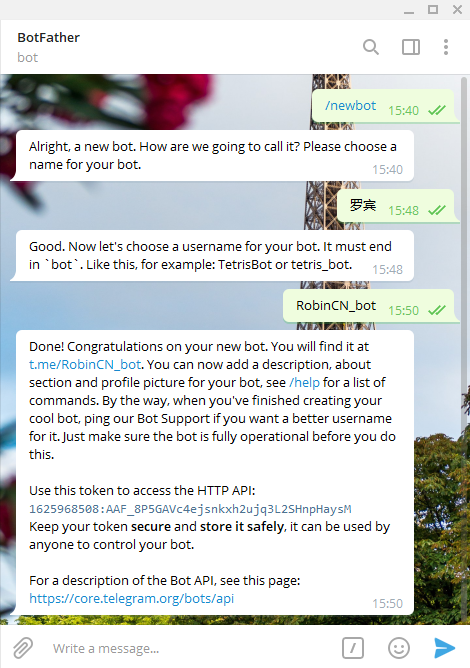

# Telegram Bot（Robin） 极简接口


起一个名字，就叫罗宾（Robin）吧。


通过简单易用的 HTTP 请求调用该接口，实现使用你自己的 TG 机器人发送数据给指定用户。

1. 你可以通过浏览器直接访问触发该接口
2. 你可以通过  curl 命令触发该接口
3. 你可以通过 python、php 等任意语言触发该接口


## 准备

请先准备好你的TG机器人`token`和`username`

示例：

token： `1625968508:AAF_8P5GAVc4ejsnkxh2ujq3L2SHnpHaysM`

username: `@RobinCN_bo`

### 申请机器人

如果你没有TG机器人，你可以通过联系 `@BotFather` 来申请一个属于你自己的机器人。

1. 发送消息 `/newbot` 给 @BotFather 来开始申请
2. 输入一个属于这个机器人的名字
3. 输入一个属于这个机器人唯一的`用户名`，别人将会通过搜索找到它
4. 得到属于这个机器人唯一的 `token`




（如图所示）


## 功能

拿到 token 和 用户名后就可以使用下面的接口 API 了。

### 获取个人信息

格式：

```
https://rb.x7.pw/me.php?token={$bot_api_key}&username={$username_bot}
```

示例：

```
https://rb.x7.pw/me.php?token=1625968508:AAF_8P5GAVc4ejsnkxh2ujq3L2SHnpHaysM&username=@RobinCN_bot
```

响应：

```json
{
	"message": "ok",
	"code": 200,
	"data": {
		"id": 1625968508,
		"is_bot": true,
		"first_name": "罗宾",
		"username": "RobinCN_bot",
		"can_join_groups": true,
		"can_read_all_group_messages": false,
		"supports_inline_queries": false,
		"bot_username": "@RobinCN_bot"
	}
}
```

### 发送消息

发送一个文本消息给联系人或者群组，必须和机器人对过话。

```
https://rb.x7.pw/send.php?token={$bot_api_key}&username={$username_bot}&chat_id={$chat_id}&text={$text}
```

示例：

```bash
curl https://rb.x7.pw/send.php?token=1625968508:AAF_8P5GAVc4ejsnkxh2ujq3L2SHnpHaysM&username=@RobinCN_bo&chat_id=900000007&text=hello
```

响应：

```j&#39;son
{
	"message": "ok",
	"code": 200,
	"data": {
		"message_id": 57,
		"from": {
			"id": 1625968508,
			"is_bot": true,
			"first_name": "罗宾",
			"username": "RobinCN_bot"
		},
		"chat": {
			"id": 900000007,
			"first_name": "ELLER",
			"type": "private"
		},
		"date": 1611765797,
		"text": "hello",
		"bot_username": "RobinCN_bo"
	}
}
```


### 发送图片消息

发送一个图片给联系人或者群组，必须和机器人对过话。

```
https://rb.x7.pw/send.php?token={$bot_api_key}&username={$username_bot}&chat_id={$chat_id}&photo={$photo_url}
```

示例：

```
https://rb.x7.pw/send.php?token=1625968508:AAF_8P5GAVc4ejsnkxh2ujq3L2SHnpHaysM&username=RobinCN_bo&chat_id=900000007&photo=https://pic.rmb.bdstatic.com/bjh/8fad2fa4b4fb43c410d35556692775f6.png
```

响应：

```json
{
	"message": "ok",
	"code": 200,
	"data": {
		"message_id": 58,
		"from": {
			"id": 1625968508,
			"is_bot": true,
			"first_name": "罗宾",
			"username": "RobinCN_bot"
		},
		"chat": {
			"id": 900000007,
			"first_name": "ELLER",
			"type": "private"
		},
		"date": 1611765905,
		"photo": [
			{
				"file_id": "AgACAgQAAxkDAAM6YBGYkTCNCHpoAhknNb5HyRNxvFoAArWrMRtfb5RQkMNhHIi7yrdFI7oqXQADAQADAgADbQADN1sBAAEeBA",
				"file_unique_id": "AQADRSO6Kl0AAzdbAQAB",
				"file_size": 22113,
				"width": 320,
				"height": 179
			},
			{
				"file_id": "AgACAgQAAxkDAAM6YBGYkTCNCHpoAhknNb5HyRNxvFoAArWrMRtfb5RQkMNhHIi7yrdFI7oqXQADAQADAgADeAADOFsBAAEeBA",
				"file_unique_id": "AQADRSO6Kl0AAzhbAQAB",
				"file_size": 82846,
				"width": 800,
				"height": 447
			},
			{
				"file_id": "AgACAgQAAxkDAAM6YBGYkTCNCHpoAhknNb5HyRNxvFoAArWrMRtfb5RQkMNhHIi7yrdFI7oqXQADAQADAgADeQADOVsBAAEeBA",
				"file_unique_id": "AQADRSO6Kl0AAzlbAQAB",
				"file_size": 139783,
				"width": 1189,
				"height": 664
			}
		],
		"bot_username": "RobinCN_bo"
	}
}
```


## 开源

该项目代码开源，你可以完全复制一个，放到自己的 VPS 上、甚至虚拟主机上，非常推荐找一个免费永久的虚拟主机放上去玩玩。

Github 地址：https://github.com/ellermister/robin